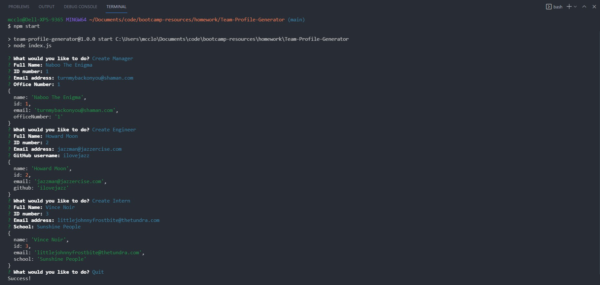
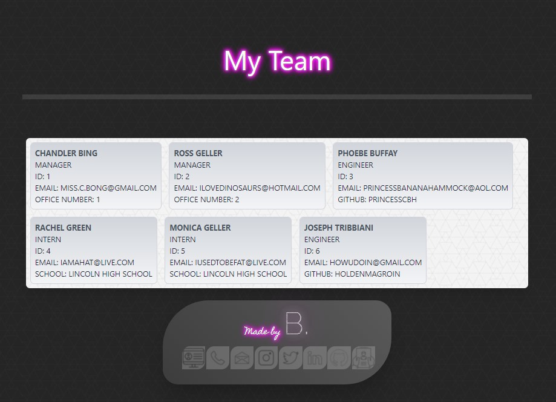

# Team-Profile-Generator

## This GitHub repository contains the code for an employee team profile generator.

---

### This applications allows for a user to view their team of employees on a simple and clean UI. The application is interactive, driven by a command line interface while the data is then displayed using a combination of generated HTML and inbuilt CSS to provide a positive UX.

---

## Table of Contents

* [Installation and Usage](#installation-and-usage)
  * [Installation](#installation)
  * [Usage and Testing](#usage-and-testing)
* [Motivation and Research](#motivation-and-research)
* [Development](#development)
  * [Web development technologies](#web-development-technologies)
  * [Graphic Design and Branding](#graphic-design-and-branding)
  * [Challenges](#challenges)
  * [Future Development Opportunities](#future-development-opportunities)
* [License](#license)
* [Contributing](#contributing)
* [Questions](#questions)
* [Repository Link:](#repository-link)
* [Application Screenshots:](#application-screenshots)
* [Walkthrough Video:](#walkthrough-video)

---

## Installation and Usage

### Installation

Clone the repository and then run this command within the repo directory:

```npm install```

### Usage and Testing

Ensure you are running the terminal from the root path of the directory.

Use ```npm test``` to run the tests within the application.

Use ```npm start``` *or* ```node index.js``` to start the application.

---

## Motivation and Research

The motivation behind this project was to begin to work with the concepts of testing code and using user input to generate HTML.

The application is designed to prompt the user to perform various activities around the data management of employees; this includes adding data including name, ID, role and email address.

The application is command line driven, and simple to use.The tests ensure that the application performs as intended. Once the team data has been added by the user, the application generates an HTML page to display this data.

Testing is a core developer activity as it ensures that existing and newly developed code is functional, efficient and performs as expected. By utilising a testing framework, testing is repeatable, reliable and automated, which leads to better code quality and fewer errors in the application being developed.

---

## Development

### Web development technologies

Development of the project was centered around using Inquirer and Jest, back end web applications for Node.js that are installed using the node package manager (NPM).

Node.js, an open-source, cross-platform, back-end JavaScript runtime environment that runs on the V8 engine and executes JavaScript code outside a web browser.

Inquirer is an NPM package that provides an easy way to capture user input in your Node. js command line interface applications.

Jest is a JavaScript testing framework.
 
Links to the languges and tools used to build this project are included below:

* HTML5
* Javascript ES6
* CSS3
* Google Fonts :
    * https://fonts.google.com/
* Node.js :
    * https://nodejs.org/
* NPM :
    * https://www.npmjs.com/
* NPM Packages :
    * Inquirer :
        * https://www.npmjs.com/package/inquirer
    * Jest :
        * https://jestjs.io/
    * Tailwind CSS
      * https://tailwindcss.com/

### Graphic Design and Branding

Working from a template image of the expected UI and functionality I developed the website layout and user interface through my HTML and the use of the TailwindCSS framework. Using the provided image as a starting point I performed heavy customisations by way of CSS styling, applying the branding I have developed for my application portfolio while meeting the specifications of the desired functionality for the application. 

Customisations included layout and styling by utilising the TailwindCSS framework, customised fonts and background images that are consistent with my other portfolio projects. The addition of an on-brand footer with links to contact information, including my Github profile and a download link of my current resume serves as a way to personalize the application.

### Challenges

The development of this application required the use of several NPM packages, including the installation of Inquirer, Jest and Tailwind CSS.

Using Jest to test functionality and develop a working application was new for me. I built unit tests to work independently and execute in parallel, as a way of exploring an automated testing methodology, and to get familiar around the concepts of planning testing as part of the development process, rather than after the application is developed.

Jest was a new technology for me as a web developer and required new thinking in my approach to testing, planning for automation and repeatable unit tests at the time that code was developed.

I installed Tailwind CSS to serve as a CSS framework to use in my HTML generation, as I have become familiar with it's syntax and used it successfully in previous projects. Tailwind CSS allowed for the use of responsive design for my HTML generation, ensuring that it looked correct on both desktop and mobile devices, and allowed me to layout the data within my backend database in a card based interface which was a core requirement for the application.

### Future Development Opportunities

Future development opportunities for the application can be focused on both the back end database and ther user interface used to run the application.

Future development on the back end database should be focused on a way to update or modify the existing data rather than overwriting the stored data each time the application is ran. As this was a proof of concept application, this was not developed for this release but would definitely be a focus for a production version of the application.

Future development on the Front end components could be focussed on providing a better user experience for users viewing or filtering the data that is displayed by the HTML based interface.

Providing a search function, allowing users to easily locate a particular users details would provide an easy way to quickly locate an employee's details once the application is storing user details for a large number of employees.

Filtering views, such as being able to view employees by a specific attribute, for example employee type would allow for the more efficient display of data that is relevant to the user searching the employee database, and allow for a more efficient display of data, particularly when combined with user search.

Being able to further segment out employee data from core roles into teams (for example HR, Finance,) would allow for end users to identify other employees within their department.

Providing a web based interface for the addition, change or viewing of employees, roles and departments would provide a superior experience for the end user accessing the application, as the data could be formatted and displayed in a way that provides access to the most relevant data first, in a way which is asthetically pleasing to the user.

By further developing the web based interface, the data that is captured by the application for storage within the CMS could also be expanded, allowing for the storage of additional employee details, such as their home address, or payroll information.  This would require additional tables and indexes to be created within the MySQL database, but would provide additional value by having a richer data set.

Using a user interface could also allow for the display of a users reporting lines or organisational structure, by utilising data such as manager or department to display the relationships between the data.

Building a security model into the application would allow for certain database fields to be marked as protected information, allowing a user to access a sub set of the available data, depending on their role.  As the application may end up storing Personally Identifiable Information (PII) this should be explored as a priority.

Finally, applying a more consistent branding experience to the resulting UI that is aligned to my other applications is also planned, reflecting my professional brand and providing a consistent UI experience across all of my developed applications.

---

## License

This repository is licensed under the MIT license.

---

## Contributing

No contributions at this time.

---

## Questions

If you have any questions, check out my <a href="https://www.github.com/blmccavanagh">GitHub</a> or email me <a href="mailto:blmccavanagh@gmail.com">here</a>.

---

<div align="center">

**Thank you for visiting.**

</div>

---

### Repository Link:

* https://github.com/blmccavanagh/Team-Profile-Generator

---

<div align="center">

### Application Screenshots:

<div align="center">

*Team Profile Generator questions asked in the terminal*

</div>



---

*Generated HTML Example*

</div>



---

<div align="center">

*Team Profile Generator walkthrough video*

</div>

<a href="">Click here to watch the video!</a>

---